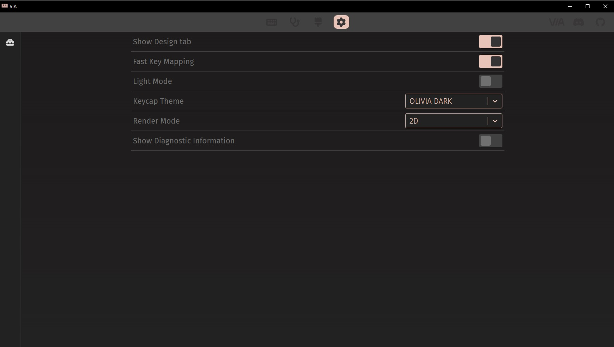
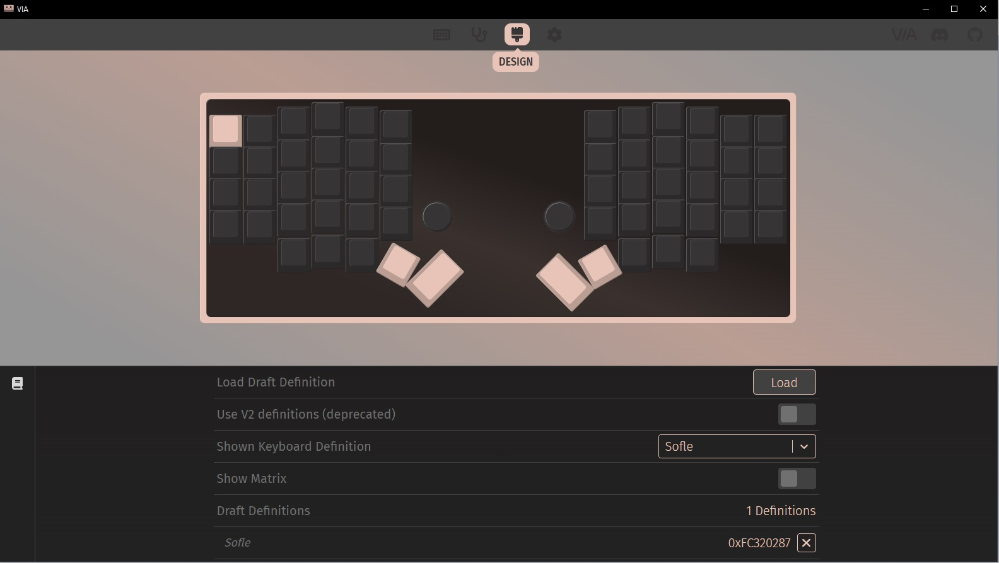
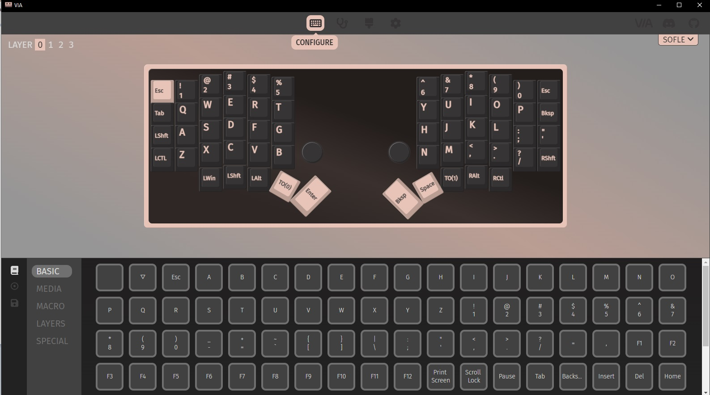
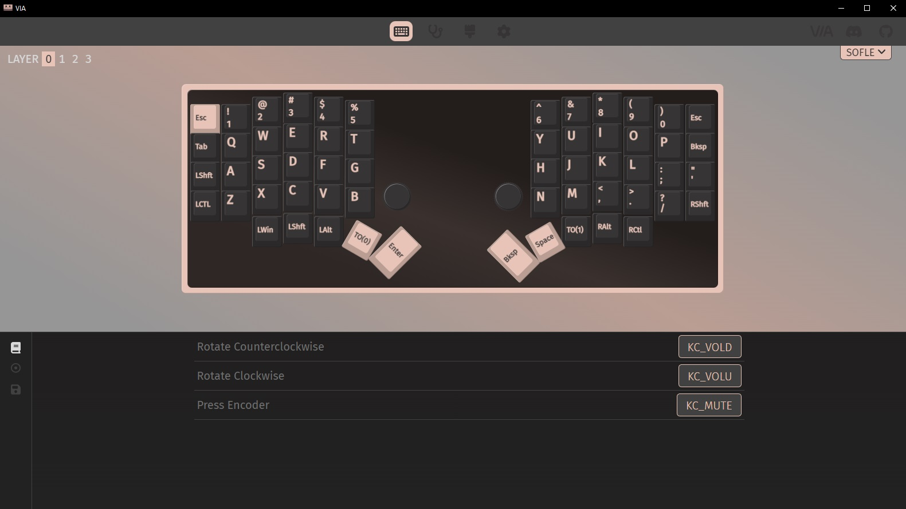

# sofle
## Issues and Warnings
DO NOT UNPLUG THE AUDIO JACK CABLE WHILE THE KEYBOARD IS PLUGGED IN

You may short it and brick half or the whole keyboard

If a key isn't working, it may be because the controller isn't pushed down and making good contact all the way. Push it down and see if that fixes it.
## Changing keys
To change the keys go to VIA (https://usevia.app/) and you'll be able to change the keys to whatever you want.

If you want to change what the knobs do, you'll have to download the VIA software and run it. Additionally, you'll need to navigate to the setting and enable dev mode.

Once you've enabled it, you can use the json file and then edit the knobs in the leftmost tab.

## Changing Rotary Encoder/Knob Function
If you want to change what the rotary encoders (the knobs) do, you'll have to edit them using VIA that is run locally.

For windows, download the [latest release](https://github.com/the-via/releases/releases) that has a name `via-3.0.0-win.exe`.

Once you have downloaded it you'll have to enable some functionality most likely.

Navigate to the settings and enable the `Show Design Tab` setting.

Click on the new design tab. Load the `/sofle/layouts/via_json/via_keyboard.json`.

Navigate to the configure tab. Here is where you can change everything but more importantly the rotary encoders.

To change what the rotary encoders do, you'll have to provide the keycodes of what you want them to do. While VIA will provide them to you in basic when you hover over them, a list of the can be found [here](https://github.com/qmk/qmk_firmware/blob/master/docs/keycodes.md)

